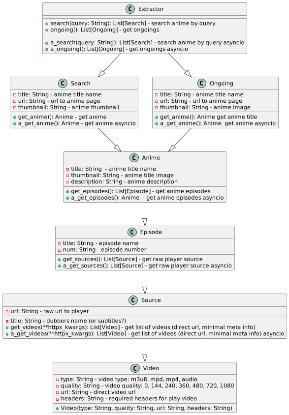

# anicli-api

Программный интерфейс набора парсеров аниме с различных источников.

Присутствует поддержка sync и async методов с помощью `httpx` библиотеки
Парсеры работают на REST-API (если у источника есть доступ), parsel и обёртки scrape-schema

# install
`pip install anicli-api`

# Overview
Структура проекта
```
anicli_api
├── base.py - базовый класс модуля-парсера
├── _http.py - сконфигурированные классы httpx
├── _logger.py - логгер
├── player - модули получения ссылок на видео
│     ├── __template__.py - шаблон модуля PlayerExtractor
│     ├── ...  ready-made модули
│     ...
└── source - модули парсеров с источников
      ├── parsers/... автоматически сгенерированные парсеры html страниц
      ├── __template__.py - шаблон для экстрактора
      ├─ ... ready-made парсеры
      ...


```

Схематичный принцип работы парсеров:



# source description
- name - имя модуля
- type - тип источника получения данных. 
  - **NO** - неофициальный (парсинг html страниц) 
  - **YES** - официальный (rest-api)
- note - примечания
- dubbers - тип озвучек. many - от различных авторов. subtitles - только субтитры. author - своя

| name           | url                        | official api | dubbers           | note                                                                    |
|----------------|----------------------------|--------------|-------------------|-------------------------------------------------------------------------|
| animego        | https://animego.org        | NO           | many              | источники kodik, animego, не работает IP отличных от СНГ                |
| animania       | https://animania.online    | NO           | many              | источник kodik, не работает IP отличных от СНГ                          |
| animejoy       | https://animejoy.ru        | NO           | subtitles         | **имеет cloudflare** (может периодически не работать), много источников |
| sovetromantica | https://sovetromantica.com | NO           | subtitles, author | не на все тайтлы есть видео, у себя хостят                              |
| anilibria      | https://anilibria.tv       | YES          | author            |                                                                         |
| animevost      | https://animevost.org      | YES          | author            |                                                                         |


# players description

Требует дополнения и дополнительных тестов

- name - имя плеера
- max quality - максимальное разрешение выдаваемое источником. Это может быть 0 (аудио, без видео), 144, 240, 360, 480, 720, 1080
- note - примечания

| name           | max quality                               | note                                                           |
|----------------|-------------------------------------------|----------------------------------------------------------------|
| kodik          | 720 (на старых тайтлах - 480)             | **работает только на IP СНГ**                                  |
| aniboom        | 1080                                      | **работает только на IP СНГ**                                  |
| sibnet         | 480                                       |                                                                |
| animejoy       | 1080                                      | только актуальные ongoing, потом видео удаляются с их серверов |
| csst           | 1080                                      |                                                                |
| dzen           | 1080                                      |                                                                |
| mailru         |                                           |                                                                |
| okru           |                                           |                                                                |
| sovetromantica | 1080                                      |                                                                |
| vkcom          | 1080 (какого качества автор зальет видео) | CDN сервера в РФ, в других странах загружается медленнее       |


# Quickstart example

```python
from anicli_api.source.animego import Extractor  # can usage any source

if __name__ == "__main__":
    ex = Extractor()
    print("PRESS CTRL + C for exit app")
    while True:
        results = ex.search(input("search query > "))
        if not results:
            print("Not founded, try again")
            continue
        
        print(*[f"{i}) {r}" for i, r in enumerate(results)], sep="\n")
        anime = results[int(input("anime > "))].get_anime()
        episodes = anime.get_episodes()
        print(*[f"{i}) {ep}" for i, ep in enumerate(episodes)], sep="\n")
        episode = episodes[int(input("episode > "))]
        sources = episode.get_sources()
        print(*[f"{i}) {source}" for i, source in enumerate(sources)], sep="\n")
        source = sources[int(input("source > "))]
        videos = source.get_videos()
        print(*[f"{i} {video}" for i, video in enumerate(videos)], sep="\n")
        video = videos[int(input("video > "))]
        print(video.type, video.quality, video.url, video.headers)

```

С asyncio аналогично, но **все** методы получения объектов имеют префикс `a_`:

```python
import asyncio
from anicli_api.source.animego import Extractor # или любой другой источник

async def main():
    ex = Extractor()
    prompt = input("search query > ")
    # a_ - async prefix.
    # simular in Ongoing, Anime, Episode, Source, Video objects
    results = await ex.a_search(prompt) 
    print(*[f"{i}) {r}" for i, r in enumerate(results)], sep="\n")
    
if __name__ == '__main__':
    asyncio.run(main())
```
## logging

Настройка логгера идет через `anicli-api`

```python
import logging
logger = logging.getLogger('anicli-api')
```

## http path

### source

Если по какой-то либо причине вас не устраивают настройки по умолчанию - то вы можете задать
конфигурацию http клиентов экстракторов

```python
from anicli_api.base import HTTPSync

from httpx import HTTPTransport

client = HTTPSync()
print(client._transport)  # anicli_api._http.HTTPRetryConnectSyncTransport
print(client.headers) # {'user-agent': 'Mozilla/5.0 (Linux; Android 6.0...', ...}

client_2 = HTTPSync(transport=HTTPTransport(), # default transport
                    headers={"user-agent": "My Cool useragent"}
                    )  

print(client_2._transport)  # httpx.HTTPTransport
print(client_2.headers)  # {'user-agent': 'My Cool useragent', ...}
assert client_2 == client  # Passed
```
### player

В player для модификации httpx клиентов (Client, AsyncioClient) необходимо передать kwargs аргументы:

```python
from anicli_api.source.animego import Extractor


sources = (
    Extractor()
    .search("lain")[0]
    .get_anime()
    .get_episodes()[0]
    .get_sources()
)

videos = sources[0].get_videos(transport=None,  # reset to default httpx.HTTPTransport
                               headers={"User-Agent": "i'm crushing :("})
```

## Структуры объектов

Приведены поля, которые **гарантированно** возвращаются в API, в некоторых источниках
могут присутствовать дополнительные поля или атрибуты для использования во внутренних методах 

Например, в `anilibria` и `animevost` почти идентичны ответам API. 
В `animego.Anime` есть несериализованный `raw_json` для извлечения дополнительных данных.

### Search
- url: str - URL на тайтл
- title: str - имя найденного тайтла
- thumbnail: str - изображение

### Ongoing
- url: str - URL на тайтл
- title: str - имя найденного тайтла
- thumbnail: str - изображение

### Anime
- title: str - имя тайтла (на русском)
- thumbnail: str - изображение
- description: Optional[str] - описание тайтла

### Episode
- title: str - имя эпизода
- num: str - номер эпизода

### Source
- url: str - ссылка на источник
- title: str - даббер или имя источника

### Video

Объект `Video`, полученный из `Source.get_video` (или `Source.a_get_video`) 
имеет следующую структуру:

* type - тип видео (m3u8, mp4, mpd, audio)
* quality - разрешение видео (0, 144, 240, 360, 480, 720, 1080)
* url - прямая ссылка на видео
* headers - заголовки требуемые для получения видео. 
Если возвращает пустой словарь - заголовки не нужны

# Примечания
- `anicli_api/source/parsers` - автоматически сгенерированные парсеры с помощью 
[scrape-schema-codegen](https://github.com/vypivshiy/selector_schema_codegen) и файлов-конфигурации [libanime](https://github.com/libanime/libanime_schema). 

- Так как это прототип и имеет свои ограничения, то при модификациях этих модулей 
используйте наследование, чтобы не потерять изменения при обновлениях.

Пример из модуля [animego](anicli_api/source/animego.py):

```python
from anicli_api.source.parsers.animego_parser import AnimeView as AnimeViewOld

class AnimeView(AnimeViewOld):
    @staticmethod
    def _parse_description(part) -> str:
        # remove whitespaces patch
        val_0 = part.css(".description ::text").getall()
        return " ".join(line.strip() for line in val_0)
```

- Проект разработан преимущественно на личное, некоммерческое использование с client-side 
стороны. 
Автор проекта не несет ответственности за поломки, убытки в высоко нагруженных проектах и решение
предоставляется "Как есть" в соответствии с [MIT](LIENSE) лицензией.

- Основная цель этого проекта — связать автоматизацию и эффективность извлечения того, 
что предоставляется пользователю в Интернете. 
Весь контент, доступный в рамках проекта, размещается на внешних неаффилированных источниках.

- **Этот проект не включает инструменты кеширования и сохранения всех полученных данных, 
только готовые реализации парсеров и программные интерфейсы**
