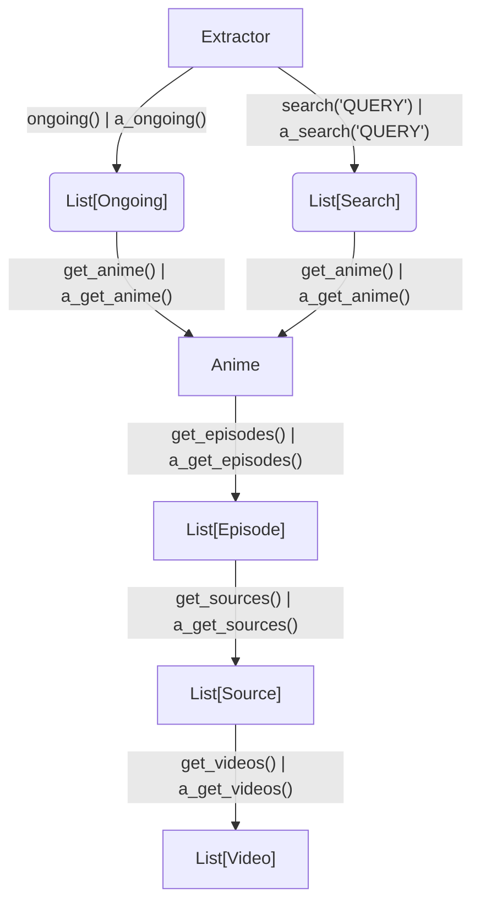

# anicli-api

Программный интерфейс набора парсеров аниме с различных источников.

Присутствует поддержка sync и async методов с помощью `httpx` библиотеки.

Парсеры работают на REST-API (если у источника есть доступ) или если такой интерфейс
отсутствует, то с помощью parsel, chompjs, jmespath, regex библиотек.


# install
`pip install anicli-api`

# Overview
Структура проекта

- source - наборы модулей для извлечения информации об аниме тайтлов из источников
- player - наборы модулей для извлечения прямой ссылки на видео

Подробнее про `source` и `player` смотрите ниже.

```
anicli_api
├── base.py - базовый класс модуля-парсера
├── _http.py - предварительно сконфигурированные классы httpx.Client и httpx.AsyncClient
├── _logger.py - логгер
├── player - модули получения ссылок на видео
│     ├── __template__.py - шаблон модуля PlayerExtractor
│     ├── ...  ready-made модули
│     ...
├── source - модули парсеров с источников
│     ├── parsers/... автоматически сгенерированные парсеры html страниц
│     ├── __template__.py - шаблон для экстрактора
│     ├─ ... ready-made парсеры
│     ...
└── tools - прочие модули

```

Схематичный принцип работы модуля из директории `source`

префикс `a_` обозначает асинхронный метод, возвращаемые объекты идентичны


# quickstart

```python
from anicli_api.source.animego import Extractor
from anicli_api.tools import cli

if __name__ == '__main__':
    cli(Extractor())
```

> Этот модуль реализован для простого ручного тестирования парсеров и "имитирует" потенциальное настоящее приложение


Пример своей реализации

```python
from anicli_api.source.animego import Extractor  # can usage any source


def _print_to_rows(items):
    print(*[f"{i}) {r}" for i, r in enumerate(items)], sep="\n")


if __name__ == "__main__":
    ex = Extractor()
    print("PRESS CTRL + C for exit app")
    while True:
        results = ex.search(input("search query > "))
        if not results:
            print("Not founded, try again")
        continue
    _print_to_rows(results)

    anime = results[int(input("anime > "))].get_anime()
    print(anime)

    episodes = anime.get_episodes()
    _print_to_rows(episodes)
    episode = episodes[int(input("episode > "))]

    sources = episode.get_sources()
    _print_to_rows(sources)
    source = sources[int(input("source > "))]

    videos = source.get_videos()
    _print_to_rows(videos)
    video = videos[int(input("video > "))]
    print(video.type, video.quality, video.url, video.headers)
```

С asyncio аналогично, но **все** методы получения объектов имеют префикс `a_`:

```python
import asyncio
from anicli_api.source.animego import Extractor # или любой другой источник

async def main():
    ex = Extractor()
    prompt = input("search query > ")
    # a_ - async prefix.
    # simular in Ongoing, Anime, Episode, Source, Video objects
    results = await ex.a_search(prompt) 
    print(*[f"{i}) {r}" for i, r in enumerate(results)], sep="\n")
    
if __name__ == '__main__':
    asyncio.run(main())
```

# Player

Эти модули можно использовать как экстрактор прямых ссылок на видео

> Эти модули минимально реализуют получение ссылок на видео с минимальными метаданными и заголовками для скачивания и
> не стремятся стать заменой yt-dlp

```python
import asyncio

from anicli_api.player.sibnet import SibNet

async def main():
    videos = await SibNet().a_parse(URL)
    print(*videos)
    
    
if __name__ == '__main__':
    URL = 'https://video.sibnet.ru/shell.php?videoid=432356'
    print(*SibNet().parse(URL))
    # asyncio support!
    asyncio.run(main())
```

# source description

- name - имя модуля
- type - тип источника получения данных.
  - **NO** - неофициальный (парсинг html документов и запросы недокументированным API методам)
  - **YES** - официальный (rest-api)
- note - примечания
- dubbers - тип озвучек.
  - many - от различных авторов.
  - subtitles - только субтитры.
  - once - один вид (случайный)
  - author - своя

| name                           | url                        | official api | dubbers           | note                                                                                                                                             |
|--------------------------------|----------------------------|--------------|-------------------|--------------------------------------------------------------------------------------------------------------------------------------------------|
| animego                        | https://animego.org        | NO           | many              | источники kodik, animego, не работает на IP отличных от СНГ и стран прибалтики. Часто попадает под РКН блокировки                                |
| sovetromantica                 | https://sovetromantica.com | NO           | subtitles, author | не на все тайтлы есть видео, у себя хостят                                                                                                       |
| anilibria                      | https://anilibria.tv       | YES          | author            |                                                                                                                                                  |
| animevost                      | https://animevost.org      | YES          | author            |                                                                                                                                                  |
| jutsu                          | https://jut.su             | NO           | once              | Запуск видео в сторонних плеерах зависим от используемого user-agent заголовка в API интерфейсе. Некоторые тайтлы заблокированы на территории РФ |
| sameband                       | https://sameband.studio    | NO           | author            |                                                                                                                                                  |
| yummy-anime.org                | https://yummy-anime.org    | NO           | many              |                                                                                                                                                  |
| yummy-anime.ru                 | https://yummy-anime.ru     | YES          | many              |                                                                                                                                                  |


# players description

> Требует дополнения и дополнительные тесты

- name - имя плеера
- max quality - максимальное разрешение выдаваемое источником. Это может быть 0 (аудио, без видео), 144, 240, 360, 480, 720, 1080
- note - примечания

| name           | max quality                                                  | note                                                                                       |
|----------------|--------------------------------------------------------------|--------------------------------------------------------------------------------------------|
| kodik          | 720 (на старых тайтлах (ранние One Peace, Evangelion) - 480) | **работает только на IP СНГ и стран прибалтики**                                           |
| aniboom        | 1080                                                         | **работает только на IP СНГ и стран прибалтики**. Иногда не возвращает mpd ссылку на видео |
| askor          | 1080                                                         |                                                                                            |
| sibnet         | 480                                                          |                                                                                            |
| csst           | 1080                                                         |                                                                                            |
| dzen           | 1080                                                         |                                                                                            |
| mailru         |                                                              |                                                                                            |
| okru           |                                                              |                                                                                            |
| sovetromantica | 1080                                                         | не на все тайтлы присутствуют видео                                                        |
| vkcom          | 1080 (какого качества автор зальет видео)                    | CDN сервера в РФ, в других странах загружается медленнее                                   |
| anilibria      | 1080                                                         |                                                                                            |
| jutsu          | 1080                                                         |                                                                                            |
| sameband       | 1080                                                         |                                                                                            |
  
## logging

Настройка логгера идет через ключ `anicli-api`

```python
import logging
logger = logging.getLogger('anicli-api')
```

## Tools

Наборы вспомогательных модулей

### cookies.py

Опциональная зависимость для извлечения cookie данных из браузера для последующего использования в httpx.
Реализована при помощи библиотеки [rookiepy](https://github.com/thewh1teagle/rookie)

```bash
pip install anicli-api[browser-cookies]
```

```python
import httpx
from anicli_api.tools.cookies import get_raw_cookies_from_browser, raw_cookies_to_httpx_cookiejar

# по умолчанию извлекает все cookies
raw_cookies = get_raw_cookies_from_browser("firefox")
cookies = raw_cookies_to_httpx_cookiejar(raw_cookies)
# опциональный фильтр по host:
# raw_cookies = get_raw_cookies_from_browser("firefox", ["example.com"])
httpx.get("https://example.com", cookies=cookies)

# update cookies in extractors:
from anicli_api.source.yummy_anime_org import Extractor
ex = Extractor()
ex.http.cookies.update(cookies)
ex.http_async.cookies.update(cookies)
```

### dummy_cli.py

Простой cli-клиент для ручных тестов и имитации клиента

```python
from anicli_api.tools.dummy_cli import cli
from anicli_api.source.yummy_anime_org import Extractor

cli(Extractor())
```

### helpers.py

Наборы вспомогательных функций для взаимодействия с экстракторами

```python
from anicli_api.source.yummy_anime_org import Extractor
from anicli_api.tools.helpers import get_video_by_quality, video_picker_iterator, async_video_picker_iterator

ex = Extractor()
result = ex.search('lain')[0]
anime = result.get_anime()
episodes = anime.get_episodes()
sources = episodes[0].get_sources()
videos = sources[0].get_videos()

# извлечь ближайшее доступное по качеству видео
# 1080 or linear quality: 720 -> 480 -> 360 -> 240...
video = get_video_by_quality(videos, 1080)

# итератор видео и заголовка
# извлекает выбранное видео по разрешению и озвучке
for video_and_title in video_picker_iterator(
        start_source=sources[0],
        start_video=videos[0],
        anime=anime,
        episodes=episodes[3:]):  # limit episodes to 3
    v, title = video_and_title
    print(title, v)

# async реализация итератора
async def main():
    async for vid_and_title in async_video_picker_iterator(
      start_source=sources[0],
        start_video=videos[0],
        anime=anime,
        episodes=episodes[3:]  # limit episodes to 3
    ):
        v, title = vid_and_title
        print(title, v)

import asyncio
asyncio.run(main())
```

### m3u.py

Реализация создания m3u плейлиста из объектов экстрактора

```python
from anicli_api.source.yummy_anime_org import Extractor

from anicli_api.tools.m3u import generate_playlist, generate_asyncio_playlist
from anicli_api.tools.helpers import video_picker_iterator, async_video_picker_iterator

ex = Extractor()
result = ex.search('lain')[0]
anime = result.get_anime()
episodes = anime.get_episodes()
# get first source for first 3 episodes
sources =  [e.get_sources()[0] for e in episodes[:3]]
videos = sources[0].get_videos()

# generate playlist from sources
playlist_sources = generate_playlist(sources)

# generate playlist from video_picker
video_objs, titles_objs = [],[]
for video_and_title in video_picker_iterator(
        start_source=sources[0],
        start_video=videos[0],
        anime=anime,
        episodes=episodes[3:]):  # limit episodes to 3
    v, title = video_and_title
    video_objs.append(v)
    titles_objs.append(title)
playlist = generate_playlist(video_objs, titles_objs)


# asyncio
# if target not Source object - you can use sync variant
import asyncio
playlist_async = asyncio.run(generate_asyncio_playlist(sources))
```


## http path

### source

Если по какой-то либо причине вас не устраивают настройки по умолчанию - то вы можете задать
конфигурацию http клиентов для экстракторов. Или если необходимо подключить proxy

```python
from anicli_api.source.animego import Extractor
import httpx
# не обязательно настраивать все клиенты, зависит от режима использования
# например, если вы будете использовать только asyncio - настраивайте только http_async_client 
my_client = httpx.Client(headers={"user-agent": "007"}, proxy="http://127.0.0.1:8080")
my_async_client = httpx.AsyncClient(headers={"user-agent": "007"}, proxy="http://127.0.0.1:8080")

# настройки клиентов будут передаваться всем объектам кроме методов Source.get_videos() 
# и Source.a_get_videos()

ex = Extractor(http_client=my_client, http_async_client=my_async_client)

# изменение http клиента для объекта
results = ex.search("lain")
result = results[0]
result.http = my_client
result.http_async = my_async_client
...

```

### player

В player для модификации httpx клиентов (Client, AsyncioClient) необходимо передать kwargs аргументы:

```python
from anicli_api.source.animego import Extractor


sources = (
    Extractor()
    .search("lain")[0]
    .get_anime()
    .get_episodes()[0]
    .get_sources()
)

videos = sources[0].get_videos(transport=None,  # reset to default httpx.HTTPTransport
                               headers={"User-Agent": "i'm crushing :("})
```

## Структуры объектов

Приведены поля, которые **гарантированно** возвращаются в API интерфейсе библиотеки.
В некоторых источниках могут присутствовать дополнительные поля или атрибуты для
использования во внутренних методах.

- Например, в `anilibria` и `animevost` поля почти идентичны ответам API.
В `animego.Anime` есть сырой несериализованный `raw_json` для извлечения дополнительных метаданных.

- В некоторых источниках на полях могут присутствовать "заглушки" для поддержания консистентности API интерфейса. Например,
в модуле `anicli_api.source.jutsu.Episode` уже можно получить прямые ссылки на видео (Video объект),
но для поддержания полиморфизма, необходимо возвращать объект `Source` и только потом `Video`
- Если по какой-либо причине объекты не получены (ddos защита, региональные ограничения) - то возвращает пустой список.
  (#TODO возможно, необходимо выбрасывать исключение?)

### Search
- url: str - URL на тайтл
- title: str - имя найденного тайтла
- thumbnail: str - изображение

### Ongoing
- url: str - URL на тайтл
- title: str - имя найденного тайтла
- thumbnail: str - изображение

### Anime
- title: str - имя тайтла (на русском)
- thumbnail: str - изображение
- description: Optional[str] - описание тайтла. может вернуть пустую строку или None

### Episode
- title: str - имя эпизода (Если источник его не хранит, то будет Серия или Serie)
- num: str - номер эпизода

### Source
- url: str - ссылка на источник
- title: str - даббер или имя источника

### Video

Объект `Video`, полученный из `Source.get_video`/`Source.a_get_video`
имеет следующую структуру:

* type - тип видео (m3u8, mp4, mpd, audio)
* quality - разрешение видео (0, 144, 240, 360, 480, 720, 1080)
* url - прямая ссылка на видео
* headers - заголовки требуемые для получения потока.
Если возвращает пустой словарь - заголовки не нужны

# Примечания

- Парсеры из директории
[anicli_api/source/parsers](anicli_api/source/parsers) автоматически генерируются с помощью
[ssc_gen](https://github.com/vypivshiy/selector_schema_codegen),
настройки хранятся в [libanime_schema](https://github.com/libanime/libanime_schema)

- Для модификаций парсеров из директории `anicli_api/source/parsers`
используйте наследование, чтобы не потерять изменения при перегенерации библиотекой `ssc_gen`.


- Проект разработан преимущественно на личное, некоммерческое использование с client-side
стороны. Проекта не несет ответственности за поломки, убытки и решение
предоставляется "Как есть" в соответствии с [MIT](LIENSE) лицензией.

- Основная цель этого проекта — связать автоматизацию и эффективность извлечения того,
что предоставляется пользователю в Интернете.
Весь контент, доступный в рамках проекта, размещается на внешних неаффилированных источниках.

- **Этот проект не включает инструменты кеширования и сохранения всех полученных данных,
только готовые реализации парсеров и программные интерфейсы**
