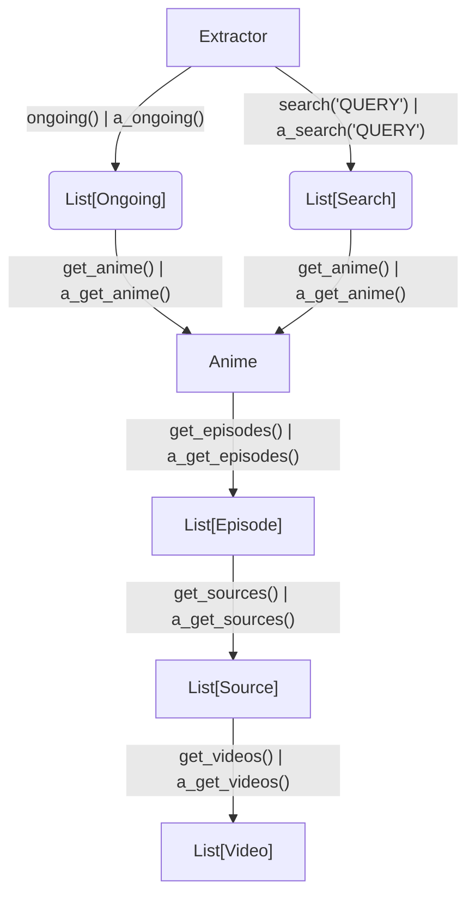

# anicli-api

Программный интерфейс набора парсеров аниме с различных источников.

Присутствует поддержка sync и async методов с помощью `httpx` библиотеки.

Парсеры работают на REST-API (если у источника есть доступ) или если такой интерфейс
отсутствует, то с помощью lxml и regex библиотек.

## install

`pip install anicli-api`

## Overview

Структура проекта

* source - наборы модулей для извлечения информации об аниме тайтлов из источников
* player - наборы модулей для извлечения прямой ссылки на видео


```
anicli_api
├── base.py - базовый класс модуля-парсера
├── _http.py - предварительно сконфигурированные классы httpx.Client и httpx.AsyncClient
├── _logger.py - логгер
├── player - модули получения ссылок на видео
│     ├── parsers/... автоматически сгенерированные парсеры html страниц
│     ├── apis/... автоматически сгенерированные LLM rest-api клиенты
│     ├── ...  ready-made модули
│     ...
├── source - модули парсеров с источников
│     ├── parsers/... автоматически сгенерированные парсеры html страниц
│     ├── apis/... автоматически сгенерированные LLM rest-api клиенты
│     ├─ ... ready-made парсеры
│     ...
└── tools - прочие модули
dev/ - служебные модули со swagger документациями API и конфигурацией html парсеров
```

Схематичный принцип работы модуля из директории `source`

префикс `a_` обозначает асинхронный метод, возвращаемые объекты идентичны



## quickstart

```python
from anicli_api.source.animego import Extractor
from anicli_api.tools import cli

if __name__ == '__main__':
    cli(Extractor())
```

> `cli()` функция реализована для простого ручного тестирования экстракторов и "имитирует" потенциальное настоящее приложение

Пример своей реализации

```python
from anicli_api.source.animego import Extractor  # can usage any source


def _print_to_rows(items):
    print(*[f"{i}) {r}" for i, r in enumerate(items)], sep="\n")


if __name__ == "__main__":
    ex = Extractor()
    print("PRESS CTRL + C for exit app")
    while True:
        results = ex.search(input("search query > "))
        if not results:
            print("Not founded, try again")
        continue
    _print_to_rows(results)

    anime = results[int(input("anime > "))].get_anime()
    print(anime)

    episodes = anime.get_episodes()
    _print_to_rows(episodes)
    episode = episodes[int(input("episode > "))]

    sources = episode.get_sources()
    _print_to_rows(sources)
    source = sources[int(input("source > "))]

    videos = source.get_videos()
    _print_to_rows(videos)
    video = videos[int(input("video > "))]
    print(video.type, video.quality, video.url, video.headers)
```

С asyncio аналогично, но **все** методы получения объектов имеют префикс `a_`:

```python
import asyncio
from anicli_api.source.animego import Extractor # или любой другой источник

async def main():
    ex = Extractor()
    prompt = input("search query > ")
    # a_ - async prefix.
    # simular in Ongoing, Anime, Episode, Source, Video objects
    results = await ex.a_search(prompt)
    print(*[f"{i}) {r}" for i, r in enumerate(results)], sep="\n")

if __name__ == '__main__':
    asyncio.run(main())
```

## Player

Эти модули можно использовать как экстрактор прямых ссылок на видео

> Эти модули минимально реализуют получение ссылок на видео с минимальными метаданными и заголовками для скачивания и
> не стремятся стать заменой yt-dlp

```python
import asyncio

from anicli_api.player.sibnet import SibNet

async def main():
    videos = await SibNet().a_parse(URL)
    print(*videos)


if __name__ == '__main__':
    URL = 'https://video.sibnet.ru/shell.php?videoid=432356'
    print(*SibNet().parse(URL))
    # asyncio support!
    asyncio.run(main())
```

## source description

- name - имя модуля
- type - тип источника получения данных.
  - **API** - rest-api (или graphql) запросы
  - **SSR** (server side rendering) - парсинг HTML страницы 
- note - примечания
- dubbers - тип озвучек.
  - many - от различных авторов.
  - subtitles - только субтитры.
  - once - один вид (случайный)
  - author - своя

| name            | url                      | type | dubbers | note                                                                           |
| --------------- | ------------------------ | ---- | ------- | ------------------------------------------------------------------------------ |
| animego         | https://animego.org      | SSR  | many    | источники kodik, animego, не работает на IP отличных от СНГ и стран прибалтики |
| anilibria       | https://aniliberty.top   | API  | author  | старое название, актуальное aniliberty                                         |
| animevost       | https://animevost.org    | API  | author  |                                                                                |
| jutsu           | https://jut.su           | SSR  | once    | Перешли на платную подписку.                                                   |
| sameband        | https://sameband.studio  | SSR  | author  |                                                                                |
| yummy_anime_org | https://yummyanime.in    | SSR  | many    |                                                                                |
| yummy_anime     | https://site.yummyani.me | API  | many    |                                                                                |
| anilib_me       | https://animelib.org     | API  | many    |                                                                                |

## players description

- name - имя плеера
- max quality - максимальное разрешение выдаваемое источником. Это может быть 0 (аудио, без видео), 144, 240, 360, 480, 720, 1080
- note - примечания

| name      | max quality                                                     | note                                                                                                                                                     |
| --------- | --------------------------------------------------------------- | -------------------------------------------------------------------------------------------------------------------------------------------------------- |
| kodik     | 720 (на старых тайтлах как ранние One Peace, Evangelion) - 480) | **работает только на IP СНГ и стран прибалтики**                                                                                                         |
| aniboom   | 1080                                                            | **работает только на IP СНГ и стран прибалтики**. Иногда не возвращает mpd ссылку на видео                                                               |
| sibnet    | 480                                                             |                                                                                                                                                          |
| anilibria | 720, иногда 1080                                                |                                                                                                                                                          |
| animevost | 720                                                             |                                                                                                                                                          |
| jutsu     | 1080                                                            | Запуск видео в сторонних плеерах зависим от используемого user-agent заголовка в API интерфейсе. Некоторые тайтлы заблокированы на территории РФ         |
| sameband  | 1080                                                            |                                                                                                                                                          |
| anilib    | 1080, 2060 (4k)                                                 | требуется авторизация для доступа к оригинальному плееру, добавить заголовок `Authorization: Bearer ...`. Авторизация через ВК работает на старом домене |

## See also

* [docs](docs.md) - lib usage
* [dev](dev) - swagger документации и dsl конфиг парсеры с рецептами изготовления

## Примечания

* **Этот проект не включает инструменты кеширования и сохранения всех полученных данных, только готовые реализации парсеров и программные интерфейсы**
* Проект разработан преимущественно на личное, некоммерческое использование с client-side стороны. Проект не несет ответственности за поломки, убытки и решение предоставляется "Как есть" в соответствии с [MIT](LIСENSE) лицензией.
* Основная цель этого проекта — связать автоматизацию и эффективность извлечения того, что предоставляется пользователю в Интернете. Весь контент, доступный в рамках проекта, размещается на внешних неаффилированных источниках.
